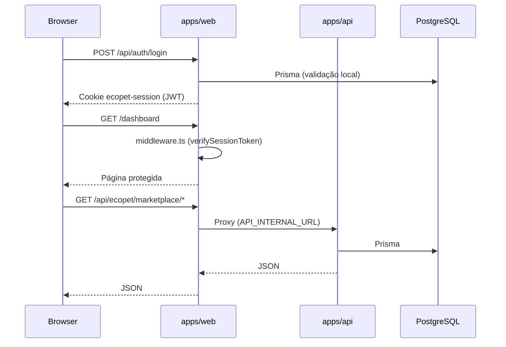

# Arquitetura EcoPet

Documentação técnica da fundação do monorepo EcoPet.

## Visão geral

```
ecopet/
├── apps/
│   ├── web/                 # Next.js 15 — frontend + API routes locais
│   └── api/                 # Express 5 — backend REST + Socket.io
├── packages/
│   └── database/            # Prisma ORM + PostgreSQL
├── scripts/                 # Automação (dev, testes, migração)
└── docs/                    # Documentação técnica
```

## Princípios arquiteturais

1. **Monorepo npm workspaces** — `@ecopet/web`, `@ecopet/api`, `@ecopet/database`
2. **Separação de camadas** — UI, serviços, domínio, persistência
3. **Proxy same-origin** — frontend acessa API via `/api/ecopet/*` (cookies HttpOnly)
4. **RBAC por role** — middleware valida permissões antes de renderizar rotas
5. **Sem mocks em produção** — dados reais via API/Prisma; placeholders visuais apenas em dev

## Banco de dados (`@ecopet/database`)

### Estrutura do pacote

```
packages/database/
├── prisma/
│   ├── schema.prisma      # Fonte única (PostgreSQL, 80+ modelos)
│   ├── seed.ts            # RBAC estrutural — sem dados fake
│   └── seed-rbac.ts
└── src/
    ├── client.ts          # Singleton Prisma (dev/prod safe)
    ├── repositories/      # Camada de acesso a dados
    └── index.ts           # Re-exports Prisma + enums
```

### Modelos principais

| Domínio | Modelos |
|---------|---------|
| Auth | `User`, `UserSession`, `PasswordResetToken`, `LoginLog` |
| Perfis | `PartnerProfile`, `OngProfile`, `TutorProfile`, `GestorProfile` |
| Pets | `Pet`, `Vaccination`, `Medication`, `Appointment` |
| Marketplace | `Product`, `Service`, `Order`, `OrderItem`, `Cart`, `CustomQuote` |
| Social | `Post`, `Message`, `Conversation`, `Notification` |
| Gestor | `AuditLog`, `ApprovalRequest`, `RbacRole`, `GestorInvite` |

### Scripts DB

| Comando | Descrição |
|---------|-----------|
| `npm run db:generate` | `prisma generate` no pacote database |
| `npm run db:push` | Sincroniza schema sem migration |
| `npm run db:migrate` | `prisma migrate dev` |
| `npm run db:studio` | Prisma Studio |
| `npm run type-check` | TS em database + web + api |

### Validação type-check da API

```bash
npm run type-check                    # Todos os workspaces
npm run type-check -w @ecopet/api     # Apenas API
npm run type-check -w @ecopet/database
```

Pré-requisito: `npm run db:generate` após alterar `schema.prisma`.

## Estrutura `apps/web/src`

```
src/
├── app/                     # App Router (páginas, layouts, API routes)
├── components/
│   ├── ui/                  # Primitivos Radix/Shadcn (Button, Card, Dialog…)
│   ├── layouts/             # AppShell, Sidebar, Header, Footer
│   ├── shared/              # Brand, Address, Accessibility, Navigation
│   └── features/            # Domínios: marketplace, social, agro, gestor…
├── modules/                 # Índice de módulos de domínio
├── services/                # Clientes HTTP (re-export de lib/*/api.ts)
├── lib/                     # Lógica de negócio, configs, utilitários
├── hooks/                   # React hooks customizados
├── providers/               # Context providers (tema, i18n, sessão, a11y)
├── store/                   # Zustand stores
├── types/                   # Tipos TypeScript centralizados
├── schemas/                 # Schemas Zod (validação de formulários)
├── constants/               # Constantes globais (brand, permissões)
├── utils/                   # Utilitários puros
├── middleware.ts            # Auth + RBAC (Next.js middleware)
├── styles/                  # globals.css, accessibility.css
├── assets/                  # Referências a arquivos em public/
└── i18n/                    # Internacionalização
```

## Fluxo de autenticação



## Camadas de componentes

| Camada | Responsabilidade | Exemplo |
|--------|------------------|---------|
| `ui/` | Primitivos visuais reutilizáveis | `Button`, `Input`, `Card` |
| `layouts/` | Estrutura de página | `AppShell`, `AppSidebar` |
| `shared/` | Cross-cutting UI | `EcopetLogo`, `SkipLink` |
| `features/` | Domínio de negócio | `MarketplaceHub`, `FeedPostCard` |

## API Routes (web)

| Endpoint | Método | Descrição |
|----------|--------|-----------|
| `/api/auth/login` | POST | Login com cookie de sessão |
| `/api/auth/register` | POST | Cadastro |
| `/api/auth/logout` | POST | Encerrar sessão |
| `/api/auth/me` | GET | Usuário autenticado |
| `/api/auth/forgot-password` | POST | Recuperação de senha |
| `/api/auth/reset-password` | POST | Redefinir senha |
| `/api/profile/me` | GET/PATCH | Perfil do usuário |
| `/api/ecopet/[...path]` | * | Proxy para API Express |

## Segurança

- **Cookies HttpOnly** para tokens de sessão
- **bcrypt** para hash de senhas
- **Validação de env** em produção (`lib/env.ts`)
- **Rate limiting** em rotas sensíveis
- **Helmet + CORS** na API Express
- **RBAC** no middleware Next.js

Variáveis sensíveis documentadas em `.env.example`. Nunca commitar `.env`.

## Acessibilidade

Fundação global implementada em `providers/accessibility-provider.tsx`:

- Skip link para conteúdo principal
- Toolbar de acessibilidade (contraste, fonte, espaçamento)
- `aria-live` para anúncios dinâmicos
- Foco visível global (`:focus-visible`)
- HTML semântico (`role="main"`, landmarks)
- Preparado para VLibras (widget existe, integração futura)

## Performance

- `next/image` para otimização de imagens
- Lazy loading de componentes pesados (`AccessibilityToolbarLazy`)
- Static generation onde possível (115 rotas)
- Bundle compartilhado ~103 kB First Load JS

## Convenções

| Tipo | Padrão | Exemplo |
|------|--------|---------|
| Componentes | PascalCase | `MarketplaceHub.tsx` |
| Hooks | camelCase com `use` | `useCurrentUser.ts` |
| Schemas Zod | camelCase + Schema | `loginSchema` |
| API clients | `lib/{domain}/api.ts` | `lib/marketplace/api.ts` |
| Stores | camelCase + Store | `marketplace-store.ts` |
| Rotas | kebab-case em português | `/meu-pet`, `/configuracoes` |

## Scripts de validação

```bash
npm run lint          # ESLint (Next.js)
npm run type-check    # TypeScript (web + api)
npm run build         # Build de produção (web)
npm run test          # Suite de testes do monorepo
```

## Deploy

| Serviço | Plataforma sugerida | Variáveis críticas |
|---------|---------------------|-------------------|
| Frontend | Vercel | `DATABASE_URL`, `AUTH_SECRET`, `NEXTAUTH_*`, `API_INTERNAL_URL` |
| API | Railway/Render | `DATABASE_URL`, `JWT_SECRET`, `WEB_URL` |
| Banco | Supabase/Neon | `DATABASE_URL`, `DIRECT_URL` |

## Maturidade atual

| Área | Nível | Notas |
|------|-------|-------|
| Arquitetura | ★★★★☆ | Estrutura enterprise alinhada |
| TypeScript (web) | ★★★★★ | Strict mode, zero erros |
| TypeScript (api) | ★★★★★ | Zero erros após unificação Prisma |
| TypeScript (database) | ★★★★★ | Pacote tipado com repositories |
| Segurança | ★★★★☆ | Env validation; revisar secrets em CI |
| Acessibilidade | ★★★☆☆ | Fundação pronta; auditoria WCAG pendente |
| Performance | ★★★☆☆ | Build OK; profiling pendente |
| Testes | ★★★☆☆ | Scripts de integração; unitários parciais |
| Documentação | ★★★★☆ | README + architecture.md |

## Pendências futuras

1. Criar migration inicial em ambiente com Postgres: `npm run db:migrate`
2. Consolidar tipos duplicados (`RobotStatus`, `ChatMessage`) entre módulos web
3. Migrar rotas API para helper `apiSuccess`/`apiFailure` padronizado
4. Integração VLibras
5. Testes unitários com cobertura mínima por módulo
6. CI/CD com lint + type-check + build obrigatórios
